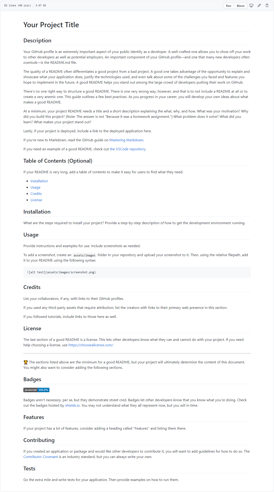

# Challenge 9: Professional README Generator

This repository contains the tools to generate a professional readme file via a series of command line prompts. By utilizing this tool, you can skip straight to developing your project!

The resulting file will conatain all the basic information any good readme file should contain including what the app is for, how to use the app, how to install it, how to report issues, and how to make contributions.

link to walkthrough video: _____________

This project was built by Delaney Charney for Challenge Assignment No.9 of the UCF Coding Bootcamp. The requirements for the assignment are detailed below.

---

## User Story

    AS A developer
        I WANT a README generator
            SO THAT I can quickly create a professional README for a new project

---

## Acceptance Criteria

    GIVEN a command-line application that accepts user input
        WHEN I am prompted for information about my application repository
            THEN a high-quality, professional README.md is generated with the title of my project and sections entitled Description, Table of Contents, Installation, Usage, License, Contributing, Tests, and Questions
        WHEN I enter my project title
            THEN this is displayed as the title of the README
        WHEN I enter a description, installation instructions, usage information, contribution guidelines, and test instructions
            THEN this information is added to the sections of the README entitled Description, Installation, Usage, Contributing, and Tests
        WHEN I choose a license for my application from a list of options
            THEN a badge for that license is added near the top of the README and a notice is added to the section of the README entitled License that explains which license the application is covered under
        WHEN I enter my GitHub username
            THEN this is added to the section of the README entitled Questions, with a link to my GitHub profile
        WHEN I enter my email address
            THEN this is added to the section of the README entitled Questions, with instructions on how to reach me with additional questions
        WHEN I click on the links in the Table of Contents
            THEN I am taken to the corresponding section of the README

---

## Mock-Up

[How to create a Professional README](./dist/readme-guide.md)

---

## Grading Requirements

This challenge is graded based on the following criteria:

### Deliverables: 20%
    A sample README generated using the application must be submitted.
    Your GitHub repository containing your application code.

### Walkthrough Video: 27%
    A walkthrough video that demonstrates the functionality of the README generator must be submitted and a link to the video should be included in your README file.
    The walkthrough video must demonstrate how a user would invoke the application from the command line.
    The walkthrough video must demonstrate how a user would enter responses to all of the prompts in the application.
    The walkthrough video must demonstrate a generated README that matches the user input and has a functioning table of contents.

### Technical Acceptance Criteria: 40%
    Satisfies all of the above acceptance criteria plus the following:
        Uses the Inquirer package (Links to an external site.).

### Repository Quality: 13%
    Repository has a unique name.
    Repository follows best practices for file structure and naming conventions.
    Repository follows best practices for class/id naming conventions, indentation, quality comments, etc.
    Repository contains multiple descriptive commit messages.
    Repository contains a high-quality README with description and a link to walkthrough video.